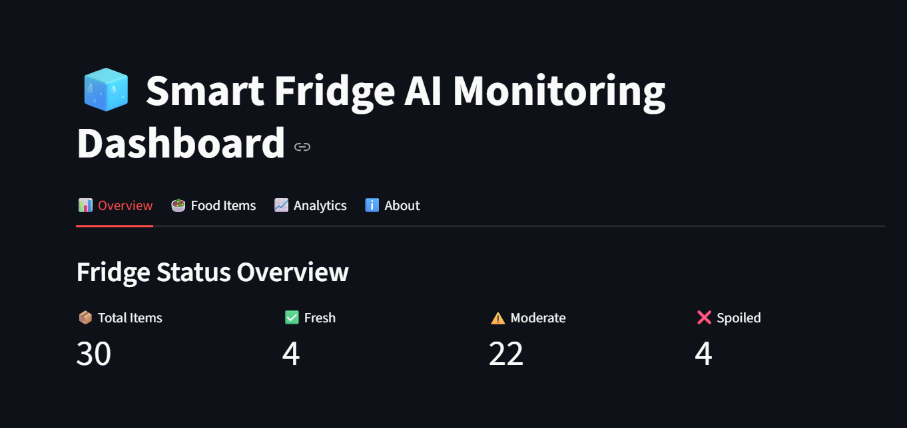
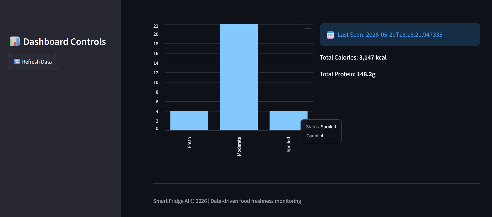
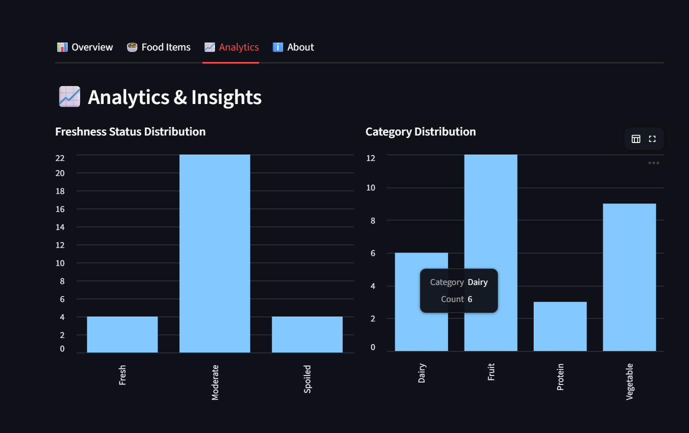

# 🧊 Smart Fridge AI Food Freshness Monitoring System

An AI-powered Smart Refrigerator System that helps reduce food wastage by monitoring food freshness, predicting spoilage, tracking inventory, scanning barcodes, and generating intelligent alerts.

---

## 📌 Project Overview

The Smart Fridge AI Food Freshness Monitoring System uses Artificial Intelligence, Computer Vision, and Deep Learning techniques to analyze food images and determine freshness levels.

The system classifies food items into:

* ✅ Fresh
* ⚠️ Moderate
* ❌ Spoiled

It also provides:

* Food inventory monitoring
* Barcode scanning
* Dashboard analytics
* Waste tracking
* Email alert notifications
* Smart food management

---

## 🚀 Features

### 🤖 AI Freshness Prediction

* Image-based food freshness detection
* Deep Learning powered classification
* Confidence score prediction

### 📷 Food Image Analysis

* Upload food images
* Automatic preprocessing
* Freshness assessment

### 📊 Dashboard Analytics

* Total food items tracking
* Fresh vs Spoiled analysis
* Food waste monitoring
* Smart statistics dashboard

### 📠 Barcode Scanner

* Product identification
* Inventory management
* Smart tracking support

### 📧 Email Alert System

* Expiry reminders
* Spoilage alerts
* Smart notifications

### 🗄️ Database Management

* Food inventory storage
* Scan history tracking
* Analytics data storage

---

## 🏗️ System Architecture

Food Image Upload

↓

Image Preprocessing

↓

AI Prediction Model

↓

Freshness Classification

↓

Database Storage

↓

Dashboard Analytics

↓

Alert Notification System

---

## 🛠️ Technologies Used

| Technology | Purpose              |
| ---------- | -------------------- |
| Python     | Backend Development  |
| Flask      | Web Framework        |
| TensorFlow | Deep Learning        |
| OpenCV     | Computer Vision      |
| NumPy      | Numerical Processing |
| SQLite     | Database             |
| HTML       | Frontend Structure   |
| CSS        | UI Styling           |
| JavaScript | Interactive Features |

---

## 📂 Project Structure

```text
SmartFridgeAI/
│
├── app.py
├── dashboard.py
├── requirements.txt
├── food_freshness_model.h5
│
├── src/
├── templates/
├── static/
├── data/
├── sample_images/
│
└── README.md
```

## ⚙️ Installation

### Clone Repository

```bash
git clone https://github.com/Rithika-BEcse/SmartFridge-AI-Food-Freshness-Monitoring.git

cd SmartFridge-AI-Food-Freshness-Monitoring
```

### Create Virtual Environment

```bash
python -m venv .venv

.venv\Scripts\activate
```

### Install Dependencies

```bash
pip install -r requirements.txt
```

### Run Application

```bash
python app.py
```

---

## 📈 Future Enhancements

* IoT-enabled Smart Refrigerator
* Mobile Application Support
* Cloud Integration
* Voice Assistant Support
* Real-Time Camera Monitoring
* Advanced AI Models
* Smart Grocery Recommendations

---

## 🎯 Applications

* Smart Homes
* Smart Kitchens
* Restaurants
* Supermarkets
* Food Industries
* Cold Storage Facilities

---

## 📸 Project Screenshots

### Dashboard Analytics


### Freshness Prediction


### Alert System


---

# 🎥 Project Demo

Watch the complete working demonstration here:

🔗 Demo Video:
https://drive.google.com/file/d/16RhfZEqSglNzdRu3rCr22wo8OCfxU0vo/view?usp=sharing

The demo showcases:

* AI Food Freshness Detection
* Live Camera Capture
* Barcode Scanning System
* Dashboard Analytics
* Smart Alert Notifications
* Food Monitoring Workflow
* Real-time Prediction Results

---


* Rithika L 


Department of Computer Science and Engineering


---

## 🏆 Project Outcome

The project successfully demonstrates the use of Artificial Intelligence and Computer Vision for smart food management by detecting freshness levels, reducing food wastage, providing analytics, and generating intelligent alerts.

---

## 📜 License

This project is developed for academic and educational purposes.
